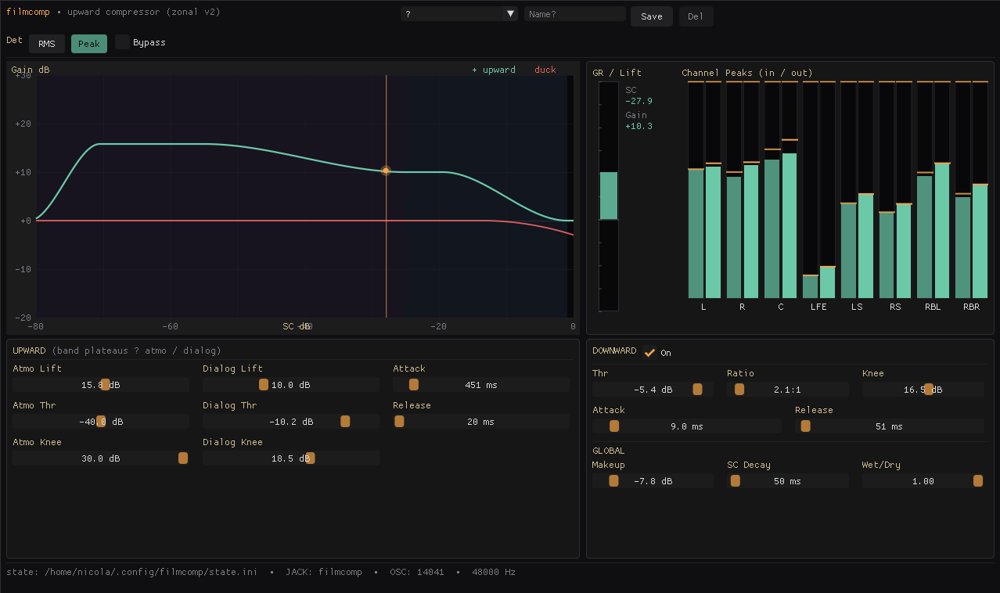

# cinecomp



A zone-aware compressor for watching films at home without waking the
neighbours — and without the dull, lifeless sound that ordinary
compression leaves behind when used on a sum signal.

It runs as a regular JACK client with a native GUI (Dear ImGui + GLFW),
so it drops straight into Carla / Catia / qjackctl / PipeWire-JACK
setups, but can equally be inserted into any PipeWire setup. It takes
the full multichannel film sum (up to 7.1) and works on the whole mix
at once.

## Why another compressor?

I had been looking for a decent compressor that works on the sum of a
5.1/7.1 film, to keep the peace with my neighbours and still enjoy my
home cinema. Modern cinema production tends to have extreme dynamics.
Listening to that in a living-room cinema, I simply lose all the little
sounds that make the atmosphere feel alive — because if I turn the
volume up far enough to hear the birds chirping in the park-scene, the
bomb suddenly going off shakes the walls. And behind those walls are neighbours.
So I needed a different approach: proper dynamic compression that takes
the characteristics of a film's final mix into account.

I tried various DAW plugins and found nothing suitable, so I wrote my
own. Every compressor I tried struggled with the things that film
soundtracks specifically bring with them.

## The three zones of a film soundtrack

**Atmosphere / ambience.** People, dogs, birds, traffic, the low hum of
a spaceship. This mostly sits around **-50 dB to -35 dB**, depending on
the type and age of the film.

**Dialogue** (including everyday sounds). Roughly **-30/-20 dB up to
about -10 dB**.

**The top end.** Action sounds in action/horror movies, or generally
the loud parts in other films where there are any, plus the music bed.
Single events might still hit 0 dB.

Older films — even action films — tend to have a louder atmosphere stage
and a quieter top end, so the *perceived* dynamic range is smaller, even
though individual events still peak at 0 dB. Modern productions spread
these zones much further apart.

## Needed: zone-aware and upward

To get *transparent* compression — compression you don't notice — you
need something that changes its behaviour depending on which zone the
signal is currently in. I tried cascading classic compressors; that was
not transparent. cinecomp instead shapes a separate, smooth gain plateau
for each zone (band-shaped weighting), with soft knees between them.

The goal: lift the atmosphere until it's nicely noticeable, lift
dialogue a little less but keep it clearly audible, and tame gunshots
and explosions so they still sound good but don't make me reach for the
volume a dozen times per film.

I never liked the idea of compressing everything that "sticks out":
used on a sum, that inevitably kills transients and becomes audible.
So cinecomp uses **upward compression** for everything below the
top-end threshold. Above it there is an optional **duck** stage — a
classic downward compressor — for the rare true spikes, but it has very
little to do, so we can run it at very gentle settings that still leave
transients nicely intact.

### Why upward compression keeps the sound alive

A normal (downward) compressor reduces gain when the signal goes *above*
a threshold: it pushes the loud parts down, then you add make-up gain to
get back to a usable level. The net effect is that the peaks — the
gunshot, the door slam, the orchestral hit — are exactly what gets
attenuated. Transients lose their snap, make-up gain drags the noise
floor up, and the whole mix ends up flatter and duller. That is the
classic "compressed" sound.

Upward compression does the opposite. Everything above the threshold is
left **completely untouched** — full original level, full transient
shape. A gunshot stays a gunshot. What changes is that the *quiet*
material underneath is raised toward the threshold, so you can lower
your listening volume to a point where gunshots stay neighbour-friendly
while atmosphere and dialogue remain perfectly audible.

Because the loud end is never reduced, there is no make-up gain pumping
the hiss up and no transient "stomp". And because each zone's lift is a
smooth, slowly-moving plateau (not a fast level-following squash), the
micro-dynamics inside the atmosphere are preserved — it still breathes,
it's just audible now. You raise the floor instead of crushing the
ceiling: louder average level, intact transients, no dullness.

For the rare spikes that would be too much even at their original level
(an explosion that still rattles the room), the optional duck stage acts
*only* on the very top, with a soft knee and look-ahead, so it tames the
wall-shaker without ever touching dialogue or atmosphere.

## Two thresholds, two lifts

A compressor like this is internally a complex thing with dozens of
parameters that all have to be right. Almost all of them are fixed to
sensible values and are **not** meant to be touched in the UI — they are
reachable through the init file if you really need them.

What you adjust per film is essentially **two thresholds and two
lifts** (atmosphere and dialogue). In practice that's all it takes to
fit the compression to any given film in seconds.

## Build

**Dependencies (Linux):**

```sh
# Debian/Ubuntu
sudo apt install build-essential pkg-config libjack-jackd2-dev libglfw3-dev libgl-dev

# Arch/Manjaro
sudo pacman -S base-devel pkgconf jack2 glfw mesa

# Fedora
sudo dnf install gcc-c++ make pkgconf jack-audio-connection-kit-devel glfw-devel mesa-libGL-devel
```

**Build:**

```sh
make
```

Output: a single self-contained ~900 KB ELF binary, `cinecomp`, in the
project root.

**Build a `.deb`** (in a throwaway `debian:12` container, so the host
needs no dev packages and the binary stays glibc-portable — glibc 2.36
runs on bookworm and every newer Debian/Ubuntu):

```sh
bash build-deb.sh            # → dist/cinecomp_<version>_amd64.deb
DOCKER_IMAGE=… bash build-deb.sh   # override base image
BUILD_NATIVE=1 bash build-deb.sh   # build on the host instead of Docker
```

## Run

```sh
./cinecomp                              # defaults
./cinecomp --name comp2 --osc 14042     # second instance
./cinecomp --state /path/to/preset.ini  # custom preset file
```

| Flag | Default | Purpose |
|---|---|---|
| `--name <s>` | `cinecomp` | JACK client name |
| `--osc <port>` | `14041` | OSC server port (UDP) |
| `--state <path>` | `$XDG_CONFIG_HOME/cinecomp/state.ini` | persistence |

Settings auto-save: ~1 s debounce on slider changes, plus a final save
on exit. The standalone build **processes by default** (bypass off) —
you install it to use it. The Bypass toggle (top header row) switches to
delay-matched pass-through.

## Architecture

cinecomp uses a single topology: **zonal v2** — band-shaped gain
plateaus per zone, an asymmetric upward envelope, and a soft-knee duck
on top. That is the whole product; there is nothing to pick.

Two earlier prototypes — *Classic* (one upward stage + duck) and
*Zonal v1* (summed atmo + dialogue stages + duck) — are retired. They
are no longer reachable from the GUI; the engine still accepts the old
`/cinecomp/architecture` OSC value only so that legacy state files keep
loading.

The v2 plateau topology is verified on hard cinema test scenes (the
John Wick double-shot, the A-Quiet-Place alarm-clock and tinkering
scenes, Das Boot on the open sea). It doesn't pump, it leaves transients
untouched, and it lifts atmosphere transparently by up to +24 dB.

## JACK ports

8 inputs / 8 outputs, 7.1 convention:

```
in_L  in_R  in_C  in_LFE  in_LS  in_RS  in_RBL  in_RBR
out_L out_R out_C out_LFE out_LS out_RS out_RBL out_RBR
```

**No per-layout configuration.** cinecomp is layout-agnostic via smooth
per-channel weights: silent ports are automatically kept out of the
detection, so the *same* settings work unchanged from plain 2.0 stereo
through 5.1 right up to 7.1 — you never tell it which layout you have.
Just wire the channels you actually use (for stereo only `in_L`/`in_R`
and `out_L`/`out_R`) and leave the rest open; the active channels are
detected and the unused ones ignored.

## Presets

A unified dropdown holds the three factory presets (**LOW / MID /
HIGH**) and any number of your own named presets. Type a name + **Save**
to store the current settings; pick an entry to load it; **Del** removes
the active named one. Selection and values persist across restarts in
the state file.

## OSC

Full UDP OSC API (same paths as the Aroio embedded-device variant of
this engine). Main controls:

```
/cinecomp/bypass i             — 0/1
/cinecomp/detector i           — 0=RMS, 1=Peak   (Dual retired)
/cinecomp/architecture i       — legacy/compat only; engine runs v2

# Zonal stages (the live topology)
/cinecomp/atmo/threshold f     /cinecomp/atmo/max_gain f    /cinecomp/atmo/knee f
/cinecomp/dialog/threshold f   /cinecomp/dialog/max_gain f  /cinecomp/dialog/knee f
/cinecomp/upward/attack_ms f   /cinecomp/upward/release_ms f
/cinecomp/duck/attack_ms f     /cinecomp/duck/release_ms f

# Legacy classic-stage paths — still accepted, but ignored under v2
/cinecomp/threshold f   /cinecomp/ratio f   /cinecomp/max_gain f
# Fixed internal guards — accepted for compat, not user-facing
/cinecomp/noise/floor f        /cinecomp/noise/knee f

# Presets
/cinecomp/preset/select i      — 0=LOW, 1=MID, 2=HIGH
/cinecomp/preset/save i        — save current params to slot N
/cinecomp/preset/reset i       — reset slot N to factory defaults
/cinecomp/named/save s         /cinecomp/named/apply s   /cinecomp/named/delete s

# Meter subscribe
/cinecomp/subscribe            — enable UDP meter broadcast
/cinecomp/unsubscribe
/cinecomp/get
```

Full list: see the doc comment at the top of `src/audio_engine.c`.

## Default values (boot)

Cinema-tuned, zonal v2 plateau topology:

```
Architecture: zonal v2     Detector: Peak           Bypass: OFF

Atmo:    thr -35   / lift +24 / knee 20
Dialog:  thr -10.5 / lift +10 / knee 13.5
Up-Env:  attack 451 ms / release 20 ms    (asymmetric: slow rise / fast fall)
Duck:    thr -14 / ratio 1.8 / knee 16.5 / attack 9 / release 51   (LOW: off)

Fixed internal guards (not in GUI):
         noise floor -80 / knee 10.5  ·  SC-HPF 20 Hz  ·  lookahead 20 ms

Legacy classic-stage params (ignored — architecture is fixed v2):
         thr -10 / ratio 4 / max_gain 10 / makeup 0
```

On first start (no state file) the MID values are applied; later changes
are persisted to the state file.

## Licenses

- cinecomp code: proprietary (Abacus Electronics)
- Dear ImGui: MIT — `vendor/imgui/LICENSE.txt`
- GLFW: zlib/libpng — distribution package
